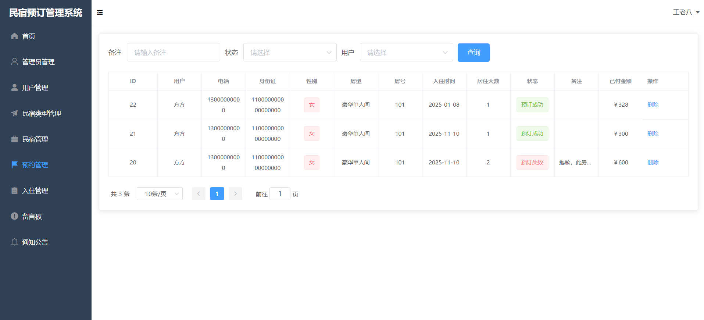

# 民宿预订管理系统 

##（源代码+12000字文档+ppt）

## 项目简介
民宿预订管理系统是一套基于SpringBoot+vue的前后端分离的系统，分为系统管理员和普通用户两个角色。 
系统管理人员可以对民宿类型、民宿信息、用户预约、用户入住以及通知公告信息进行管理，还可以通过图表的方式对日常运行数据进行统计分析。 
普通用户可以查看所有的民宿信息、通知公告信息以及预订房间，还可以给管理员进行留言。 
前端使用Vue+ElementUI框架，后端使用SpringBoot+MyBatis框架，数据库使用的是Mysql。 
本系统功能完善，涉及的技术比较广，难度适中，都是市面上主流的技术，非常适合作为设计项目或开发学习。 
视频介绍：<a href="https://www.bilibili.com/video/BV1AhraYMEnV/?spm_id_from=333.999.0.0" target="_blank">点击查看B站视频介绍</a>

## 功能介绍

## 技术学习

如果你有任何需求，可以关注本人公众号获取本人联系方式进行咨询。 
公众号内还有更多项目供你选择。 

## 技术服务

## 技术栈

| 工具及技术             | 版本    |
| ---------------------- | ------- |
| idea                   |         |
| JDK                    | 1.8     |
| SpringBoot             | 2.2.1   |
| MyBatis                | 1.3.2   |
| JWT                    | 3.4     |
| Vue                    | 2.0     |
| ElementUI              | 2.0     |
| MySQL                  | 5.7     |
| Node                   | v16.16.0|

## 系统图片

#### 1.登录页面
 
#### 2.管理员首页
 
#### 3.民宿类型管理
 
#### 4.民宿管理
 
#### 5.预订管理
 
#### 6.入住管理
 
#### 7.通知公告
 
#### 8.用户端首页
 
#### 9.用户预订房间
 
#### 10.留言板
 

